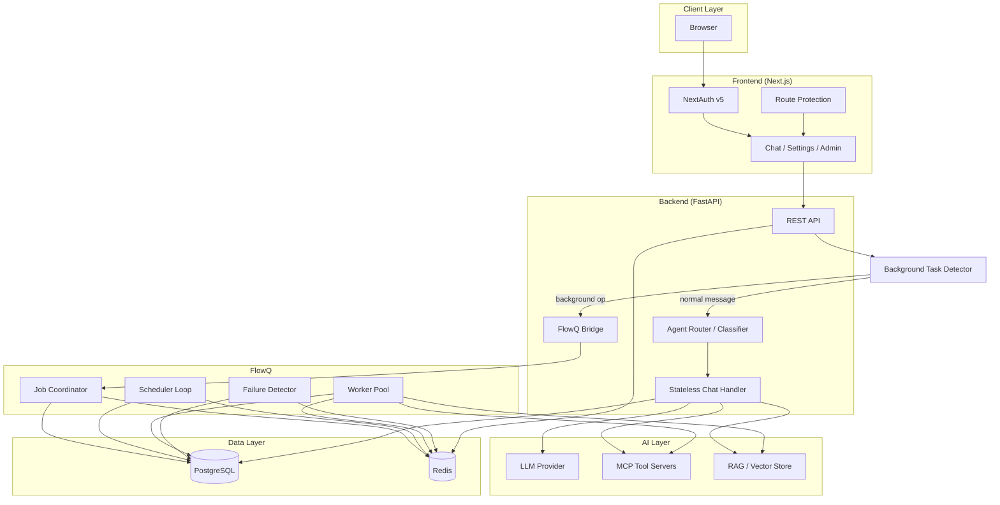
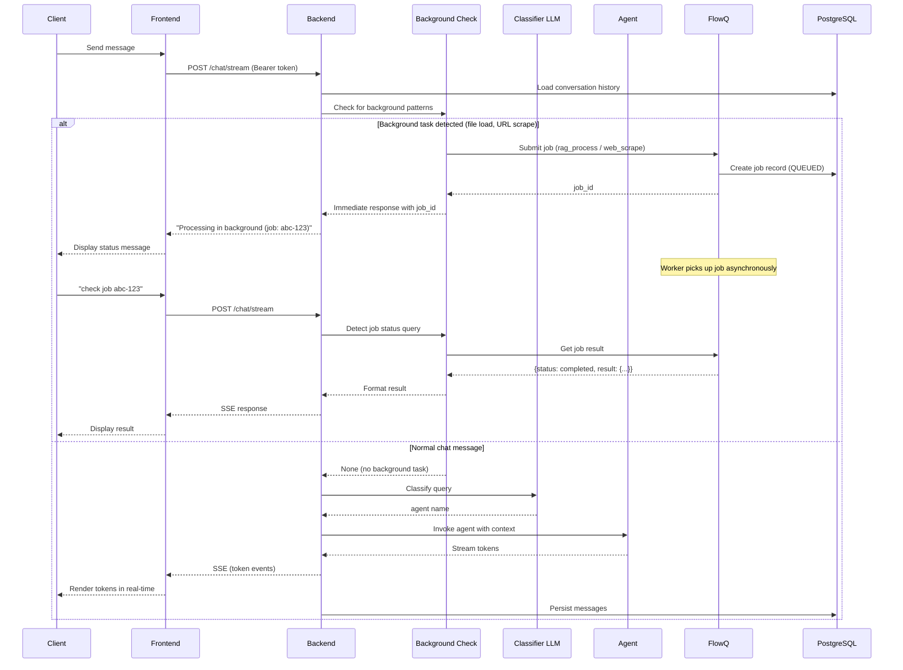
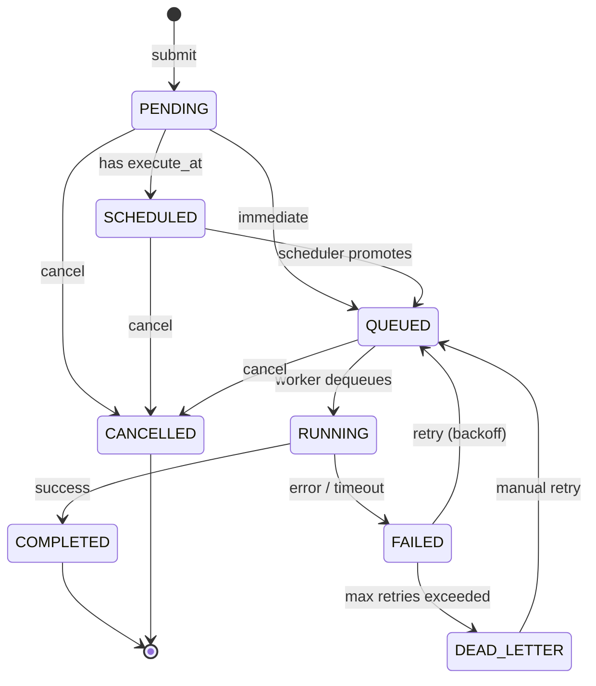
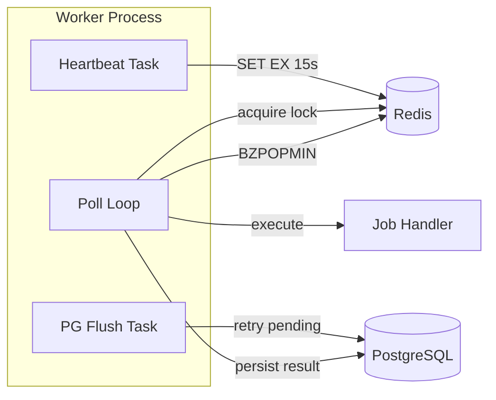
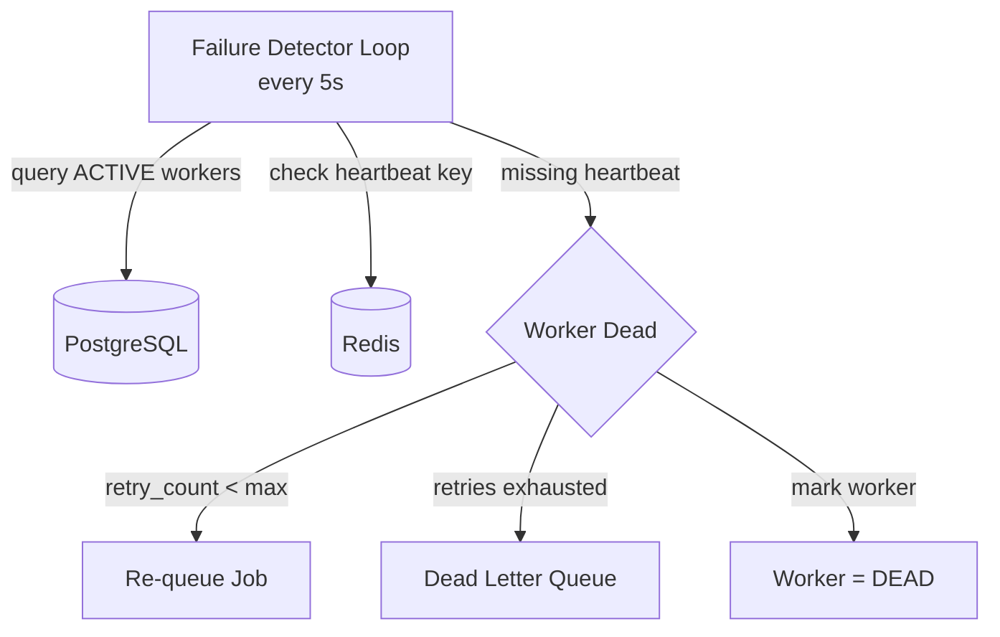
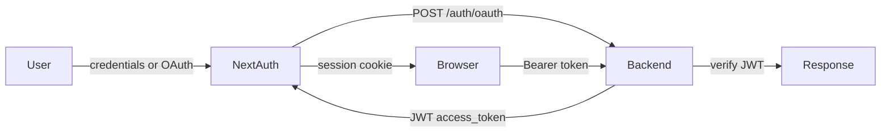

<div align="center">

# Mosaic — System Design

</div>

---

## System Overview

Mosaic is a multi-agent AI assistant with a distributed task processing backend. The system has two major subsystems:

1. **Chat System** — real-time agent routing, streaming LLM responses, conversation persistence
2. **FlowQ** — fault-tolerant distributed job processing for long-running operations

Both share PostgreSQL and Redis infrastructure.



---

## Chat System

### Request Flow



### Agent Registry

Agents are initialized once at startup and shared across requests (stateless):

| Agent | Tools | Purpose |
|-------|-------|---------|
| general | None | Writing, coding, math, creative tasks |
| web | TavilySearch | Live info (news, weather, scores) |
| rag | load_document, query_documents | Document Q&A |
| {mcp_server} | Dynamic from server | Custom tool execution |

### Classification

The classifier LLM receives:
- Available agents and their descriptions
- The user's current message
- Rules: "when in doubt, use general"

Returns a single agent name. The chosen agent then processes the full message with conversation history as context.

### Conversation Persistence

- Messages stored in PostgreSQL (`conversations` + `messages` tables)
- Each request loads the last N messages from DB (no in-memory state)
- Ownership enforced: users only see their own conversations
- Auto-creates conversation on first message

---

## FlowQ

### Purpose

Offloads long-running operations from the synchronous chat flow:
- MCP tool calls that take > 5 seconds
- PDF processing and RAG document indexing
- Web scraping
- Batch message processing

The chat handler automatically detects these operations via pattern matching on the user message. When detected, the job is submitted to the queue and the user receives an immediate acknowledgment with a job ID. Normal conversational messages bypass the queue entirely.

**Auto-detected patterns:**

| User message pattern | Job type submitted |
|---------------------|-------------------|
| "load document 'file.pdf'" | `rag_process` |
| "process pdf 'report.pdf'" | `rag_process` |
| "scrape https://example.com" | `web_scrape` |
| "fetch url https://..." | `web_scrape` |
| "check job abc-123-..." | Queries job status (no submission) |
| Everything else | No queue — processed by LLM directly |

### Job Lifecycle



### Priority Queue

Redis sorted set (`queue:priority`) with score:

```
score = -priority * 1,000,000,000,000 + enqueued_at_ms
```

- Higher priority produces lower score, popped first by `BZPOPMIN`
- Equal priority = FIFO by enqueue time
- Additional sorted sets: `queue:scheduled`, `queue:retry`, `queue:dlq`

### Worker Architecture



Each worker:
1. Registers in PostgreSQL (ACTIVE status, hostname, PID)
2. Sends heartbeat every 5s (Redis key with 15s TTL)
3. Blocking dequeue from priority queue (5s timeout)
4. Acquires distributed lock (Redis SET NX, TTL = job_timeout + 30s)
5. Executes handler with `asyncio.wait_for(timeout)`
6. Persists result to PostgreSQL
7. Releases lock in `finally` block

### Failure Detection



- Detection time: < 20 seconds (15s heartbeat TTL + 5s check interval)
- Uses `SELECT ... FOR UPDATE` to prevent double-recovery
- Abandoned RUNNING jobs are re-queued with incremented retry_count

### Retry with Exponential Backoff

```
delay = min(base^retry_count, 300s) + random(0, 0.1 * delay)
```

- Default base: 2.0 (2s, 4s, 8s, 16s, 32s, 64s, 128s, 256s, 300s cap)
- Jitter prevents thundering herd
- Failed jobs go to `queue:retry` sorted set with score = next_retry_at_ms
- Scheduler promotes when backoff elapses

### State Reconstruction

On startup or Redis recovery:
1. Clear all Redis queue keys
2. Rebuild `queue:priority` from all QUEUED jobs in PostgreSQL
3. Rebuild `queue:scheduled` from SCHEDULED jobs
4. Recover RUNNING jobs (treated as abandoned: re-queue or DLQ)
5. Block new submissions until complete

Ensures the system recovers fully from any restart or Redis failure.

### Distributed Lock

```
Key:    lock:job:{job_id}
Value:  worker_id
TTL:    job_timeout + 30s
```

- `SET NX` for acquisition (atomic, no race conditions)
- Lua script for release (compare-and-delete, only holder can release)
- Prevents double-execution when recovery re-queues a job still being processed

---

## Data Layer

### PostgreSQL Tables

| Table | Purpose |
|-------|---------|
| `conversations` | Chat conversation metadata (title, user_id, timestamps) |
| `messages` | Individual messages (role, content, agent, timestamp) |
| `users` | User accounts (username, email, password_hash, role, verified) |
| `user_mcp_servers` | Per-user MCP server configurations |
| `jobs` | Job state, payload, result, retry config |
| `job_executions` | Execution history per attempt |
| `workers` | Worker registration and status |

### Redis Keys

| Key Pattern | Type | Purpose |
|-------------|------|---------|
| `queue:priority` | Sorted Set | Active job queue |
| `queue:scheduled` | Sorted Set | Future-scheduled jobs |
| `queue:retry` | Sorted Set | Jobs waiting for backoff |
| `queue:dlq` | Sorted Set | Dead-letter queue |
| `heartbeat:{worker_id}` | String (TTL) | Worker liveness |
| `lock:job:{job_id}` | String (TTL) | Distributed execution lock |
| `metrics:latency_samples` | Sorted Set | 60s sliding window of latency data |
| `metrics:completed_count` | String | Total completed counter |
| `mosaic:ratelimit:*` | Sorted Set | Rate limiter windows |

---

## Authentication



- Sessions: httpOnly signed cookies (XSS-safe)
- Backend tokens: JWT with type, expiry, role
- Rate limiting: 5 login attempts / 5 min per IP
- SSRF protection: blocks private IPs on MCP server URLs (temporarily disabled for local dev)
- Passwords: bcrypt with salt

---

## Monitoring & Metrics

Collected in real-time via Redis sorted sets (60s sliding window):

| Metric | Source |
|--------|--------|
| Queue depth | `ZCARD queue:priority` |
| Active workers | PostgreSQL count (status=ACTIVE) |
| Jobs/second | Completed count in last 60s / 60 |
| Latency P50/P95 | Sorted latency samples, nearest-rank percentile |
| DLQ size | `ZCARD queue:dlq` |

Exposed via `GET /flowq/metrics` and visible in the admin panel.

---

## Scalability Properties

| Property | How |
|----------|-----|
| Horizontal worker scaling | Add workers without architecture changes |
| Stateless API | No in-memory conversation state, DB loaded per request |
| Connection pooling | SQLAlchemy QueuePool (10 + 20 overflow) |
| Multi-instance scheduler | Atomic ZREM prevents double-promotion |
| Multi-instance failure detector | SELECT FOR UPDATE prevents double-recovery |
| Redis as coordination layer | All queue ops are atomic (ZADD, BZPOPMIN, ZREM) |
| PostgreSQL as source of truth | Redis is fully reconstructable from PG |
