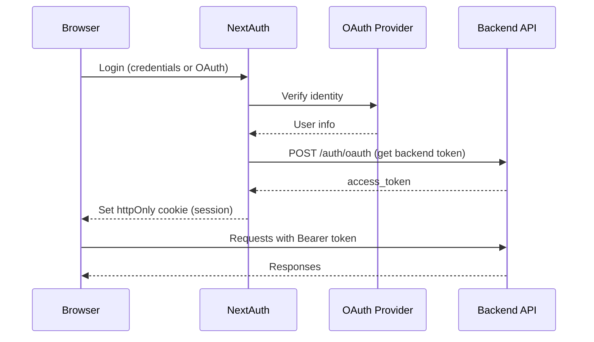

# Authentication

> Powered by [NextAuth v5 (Auth.js)](https://authjs.dev/) with httpOnly cookie sessions.

---

## Providers

| Provider | Enable by setting |
|----------|-------------------|
| Credentials | `ADMIN_PASSWORD` + `USER_PASSWORD` in `Backend/.env` |
| Google | `GOOGLE_CLIENT_ID` + `GOOGLE_CLIENT_SECRET` in `Frontend/.env` |
| GitHub | `GITHUB_CLIENT_ID` + `GITHUB_CLIENT_SECRET` in `Frontend/.env` |
| Microsoft | `MICROSOFT_CLIENT_ID` + `MICROSOFT_CLIENT_SECRET` in `Frontend/.env` |

> Providers without client IDs are hidden from the login page automatically.

---

## OAuth Redirect URIs

Register in your provider's developer console:

```
https://yourdomain.com/api/auth/callback/google
https://yourdomain.com/api/auth/callback/github
https://yourdomain.com/api/auth/callback/microsoft-entra-id
```

---

## Roles

| Role | Assignment | Access |
|------|-----------|--------|
| `admin` | `ADMIN_USERNAME` in env, or email in `ADMIN_EMAILS` | Full access |
| `user` | All other accounts | Chat, own conversations, MCP servers |

---

## Session Flow



---

## Security

| Measure | Implementation |
|---------|---------------|
| Session storage | Signed httpOnly cookies (JS cannot access) |
| CSRF protection | Built into NextAuth |
| Password hashing | bcrypt with salt |
| Brute force | Rate limiter (5 attempts / 5 min per IP) |
| Token forgery | Signed with `AUTH_SECRET` + `JWT_SECRET` |
| Route protection | Next.js middleware (server-side) |
| API protection | FastAPI dependency injection |

---

## Environment Variables

```env
# Frontend/.env
AUTH_SECRET=<openssl rand -base64 32>
AUTH_TRUST_HOST=true

# OAuth (all optional)
GOOGLE_CLIENT_ID=
GOOGLE_CLIENT_SECRET=
GITHUB_CLIENT_ID=
GITHUB_CLIENT_SECRET=
MICROSOFT_CLIENT_ID=
MICROSOFT_CLIENT_SECRET=

# Admin emails (for OAuth role assignment)
ADMIN_EMAILS=admin@example.com,other@admin.com
```
