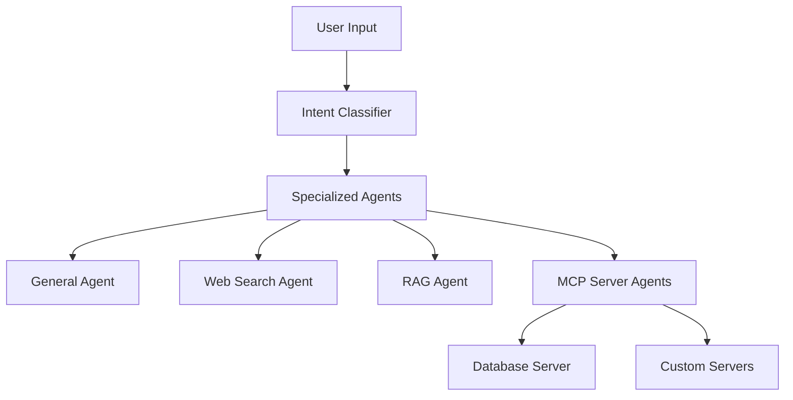

# Mosaic - Multi-Agent Client for MCP Servers

> A modern multi-agent client framework that connects to MCP (Model Context Protocol) servers using OpenAI and LangChain.

[](https://python.org)
[](LICENSE)
[](VERSION)
[](https://openai.com)
[](https://langchain.com)
[](https://modelcontextprotocol.io/)

## 📖 Overview

**Mosaic** is a multi-agent client framework that intelligently routes user queries to specialized agents and MCP (Model Context Protocol) servers. Mosaic provides a way to integrate MCP servers with OpenAI GPT models using LangChain.

### 🚀 Key Features

- **Multi-Agent Client Framework**: Route queries to specialized agents and MCP servers
- **Intelligent Query Classification**: Automatically determines the best agent for each query
- **Built-in Capabilities**: Web search, RAG, and general conversation
- **MCP Server Integration**: Connect to any MCP-compatible server
- **OpenAI + LangChain**: Leverage GPT models with custom tools
- **Easy Extension**: Simple to add new agents and MCP servers
- **Configuration Templates**: Ready-to-use server configurations

## 🏗️ Architecture



## 🤖 Built-in Agent Specializations

### General Agent
- Handles general conversation and follow-up questions
- Provides context-aware responses
- Manages conversation flow

### Web Search Agent
- Real-time information retrieval (news, sports, weather, etc.)
- Current events and live data
- Breaking news and updates

### RAG Agent
- Document analysis and processing
- PDF and image content extraction
- Semantic search across documents
- Knowledge base management

## 🔌 Pre-defined MCP Servers

### Database Manager Server (Example Add-on)
- Full database operations (CRUD)
- Table creation and management
- Data analysis and queries
- SQL execution with safety checks

*Note: This is an example MCP server provided with Mosaic. You can create your own MCP servers or connect to existing ones.*

## 🛠️ Installation & Setup

### Prerequisites

- Python 3.8 or higher
- OpenAI API key
- Tavily API key (for web search)

### Quick Start

1. **Clone the repository**
   ```bash
   git clone https://github.com/garvit-mehra/mosaic.git
   cd mosaic
   ```

2. **Create a virtual environment**
   ```bash
   python -m venv venv
   source venv/bin/activate  # On Windows: venv\Scripts\activate
   ```

3. **Install dependencies**
   ```bash
   pip install -r requirements.txt
   ```

4. **Set up your API keys**
   Create a `.env` file in the project root:
   ```env
   OPENAI_API_KEY=your_openai_api_key_here
   TAVILY_API_KEY=your_tavily_api_key_here
   ```

5. **Start MCP servers (optional)**
   ```bash
   # Example: Start the database server
   python servers/database_server.py
   ```

6. **Run Mosaic**
   ```bash
   cd examples
   python mosaic_template.py
   ```

7. **Test the integration (optional)**
   ```bash
   # Make sure the database server is running first
   python servers/database_server.py
   ```

## ⚙️ Configuration

### MCP Server Configuration

Connect to any MCP-compatible server:

#### Custom MCP Server
```python
{
    "name": "your_server_name",
    "description": "Description of what your server does.",
    "url": "http://localhost:PORT/sse",
    "transport": "sse"  # Optional, defaults to "sse"
}
```

### Client Configuration

Edit `client.py` to customize:

```python
# Model and AI settings
MODEL_NAME = "gpt-5-nano"  # Change AI model
MAX_HISTORY_EXCHANGES = 5    # Conversation memory length
```

### RAG Configuration

Edit `utils/ProcessPDF.py` to customize document processing:

```python
# Document chunking settings
chunk_size = 1000      # Size of text chunks
chunk_overlap = 200    # Overlap between chunks
max_search_results = 5 # Number of results to return
```

## 🎯 How Mosaic Works

### 1. Query Classification
When you send a message, the system:
- Analyzes your intent using an AI classifier
- Determines which agent is best suited for your query
- Routes the query to the appropriate specialized agent or MCP server

### 2. Agent Processing
Each agent has specific capabilities:
- **General Agent**: Handles conversation and follow-ups
- **Web Agent**: Searches for current information
- **RAG Agent**: Processes and queries documents
- **MCP Agents**: Connect to external MCP servers

### 3. Response Generation
- The selected agent processes your query
- Uses its specialized tools and knowledge
- Returns a contextually relevant response

### 4. Conversation Management
- Maintains conversation history across agents
- Provides context for follow-up questions
- Manages session state and memory

## 📚 Usage Examples

### Built-in Web Search
```
You: What's the latest news about AI?
Mosaic (Web-Agent): Here are the latest developments in AI...
```

### Built-in Document Analysis
```
You: load document reports/quarterly_report.pdf
Mosaic (RAG-Agent): Successfully loaded document: Document 'quarterly_report.pdf' added to knowledge base with 15 chunks.

You: What were the quarterly results?
Mosaic (RAG-Agent): Based on the quarterly report, the company achieved...
```

### MCP Server Operations (Example)
```
You: Create a table called users with columns name, email, and age
Mosaic (Database-Agent): Table 'users' created successfully with columns: name (TEXT), email (TEXT), age (INTEGER)

You: Insert a user named John with email john@example.com and age 30
Mosaic (Database-Agent): Inserted row into users
```

### General Conversation
```
You: Can you help me understand how this system works?
Mosaic (General-Agent): I'd be happy to explain! Mosaic is a multi-agent client framework that...
```

## 📁 Project Structure

```
mosaic/
├── README.md                 # Documentation
├── requirements.txt          # Python dependencies
├── CHANGELOG.md              # Version history
├── .env                      # Your API keys (create this, not in repo)
├── client.py                 # Main client application
├── examples/                 # Templates
│   ├── mosaic_template.py    # Template for custom configurations
├── servers/                  # Example MCP servers
│   ├── database_server.py    # Example SQLite database server
│   └── db.sqlite             # Database file (auto-created)
├── utils/                    # Utility modules
│   ├── __init__.py           # Package initialization
│   ├── RAGTools.py           # RAG/document retrieval tools
│   ├── ProcessPDF.py         # PDF/image processing tools
│   ├── Clients.py            # Legacy MCP client implementations
│   └── ConversationDB.py     # Conversation database manager
└── mosaic.log                # Log file (auto-created)
```

## 🔧 Advanced Configuration

### Creating Custom MCP Servers

1. **Create a new server file** in `servers/`:
```python
#!/usr/bin/env python3
from mcp.server.fastmcp import FastMCP

mcp = FastMCP(
    name="Your Custom Server",
    host="127.0.0.1",
    port=8001  # Choose a unique port
)

@mcp.tool(
    name="your_tool",
    description="Description of what your tool does"
)
async def your_tool(param: str) -> str:
    # Your tool implementation
    return "Tool result"

if __name__ == "__main__":
    mcp.run()
```

2. **Add to client configuration**:
```python
SERVER_CONFIGS = [
    # ... existing configs
    {
        "name": "your_server",
        "description": "Your custom server description",
        "url": "http://localhost:8001/sse"
    }
]
```

### Environment Variables

Only API keys should be in your `.env` file:
```env
OPENAI_API_KEY=your_openai_api_key_here
TAVILY_API_KEY=your_tavily_api_key_here
```

All other settings are configured directly in the code files for easy customization.

## 🚀 Deployment

### Local Development
```bash
# Terminal 1: Start MCP servers (optional)
python servers/database_server.py

# Terminal 2: Start client
python client.py
```

### Production Considerations
- Use environment variables for all API keys
- Implement proper logging and monitoring
- Consider using a process manager like PM2
- Set up proper firewall rules for server ports

## 🤝 Contributing

Contributions are welcome! Here's how to get started:

1. **Fork the repository**
2. **Create a feature branch**
   ```bash
   git checkout -b feature/your-feature-name
   ```
3. **Make your changes**
4. **Add tests** (if applicable)
5. **Submit a pull request**

### Development Setup
```bash
git clone https://github.com/your-username/mosaic.git
cd mosaic
python -m venv venv
source venv/bin/activate
pip install -r requirements.txt
```

## 📄 License

This project is licensed under the MIT License - see the [LICENSE](LICENSE) file for details.

## 🙏 Acknowledgments

- [LangChain](https://langchain.com) for the AI framework
- [OpenAI](https://openai.com) for GPT models
- [Tavily](https://tavily.com) for web search capabilities
- [FAISS](https://github.com/facebookresearch/faiss) for vector search
- [MCP](https://modelcontextprotocol.io/) for the server protocol


---

*Made with ❤️ by Mosiac Team*

**Ready to build amazing multi-agent applications with MCP servers? Start with Mosaic! 🚀** 
