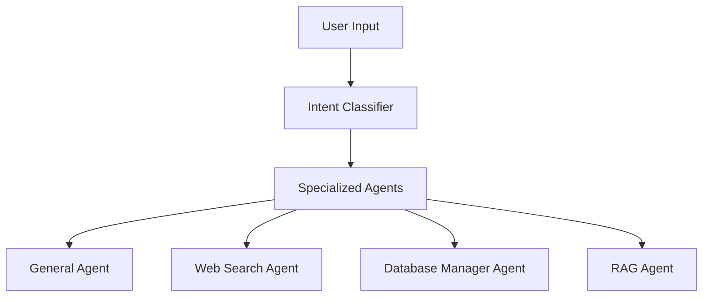

# Mosaic - Modular Multi-Agent Tools for Python

> A modern toolkit for building, combining, and experimenting with modular multi-agent tools.

[](https://python.org)
[](LICENSE)
[](https://openai.com)
[](https://langchain.com)

## Overview

**Mosaic** is a personal project by Garvit Mehra. It's a modular, multi-agent toolkit for Python that lets you route user queries to specialized tools/agents for database management, web search, document analysis, and general conversation. Each agent is optimized for specific tasks, and you can easily extend or remix the toolkit for your own experiments.

### Key Features

- Modular multi-agent architecture
- Intelligent routing of queries to the right tool/agent
- Database management (SQLite + MCP integration)
- Real-time web search (Tavily API)
- Document analysis (RAG, PDF, image support)
- Context-aware conversation
- Simple, hackable, and easy to extend

## Architecture



## Agent Specializations

### General Agent
- Handles general conversation and follow-up questions

### Web Search Agent
- Real-time information retrieval (news, sports, weather, etc.)

### Database Manager Agent
- Full database operations, CRUD, and analysis

### RAG Agent
- Document analysis, PDF/image processing, semantic search

## Installation

### Prerequisites

- Python 3.8 or higher
- OpenAI API key
- Tavily API key (for web search)

### Quick Start

1. **Clone the repository**
   ```bash
   git clone https://github.com/garvit-mehra/mosaic.git
   cd mosaic
   ```

2. **Install dependencies**
   ```bash
   pip install -r requirements.txt
   ```

3. **Set up your API keys**
   - Create a `.env` file in the project root with only your API keys:
     ```env
     OPENAI_API_KEY=your_openai_api_key_here
     TAVILY_API_KEY=your_tavily_api_key_here
     ```
   - Do **not** include any other settings in `.env`.

4. **Run the Server and Client**
   - Start the database server (in one terminal):
     ```bash
     python server.py
     ```
   - Start the main client (in another terminal):
     ```bash
     python client.py
     ```

## Configuration Guide

**Only API keys should be in your `.env` file.**

All other settings (such as model, history length, logging, chunk size, etc.) are configured directly in the code files. Here's how to change them:

### 1. **Model, History, and Logging**
- **File:** `client.py`
- **Variables to edit:**
  - `MODEL_NAME` (e.g., "gpt-4.1-mini")
  - `MAX_HISTORY_EXCHANGES` (number of back-and-forths to keep in memory)
  - Logging file name and level (see `logging.basicConfig`)

### 2. **Database and Server Settings**
- **File:** `server.py`
- **Variables to edit:**
  - Database file path (edit `get_database_path()` if needed)
  - Server port and host (edit `FastMCP` initialization)

### 3. **RAG and Document Processing**
- **File:** `utils/ProcessPDF.py` and `utils/RAGTools.py`
- **Variables to edit:**
  - Chunk size, overlap, and max search results (see function arguments and constants)

### 4. **Other Customizations**
- You can further customize agent prompts, toolsets, and behaviors directly in `client.py` under the agent setup section.

**After making changes, simply restart the relevant Python process (client or server) to apply your new settings.**

## Usage

### Basic Usage

```bash
python client.py
```

### Example Conversations

#### Database Operations
```
You: Create a table called users with columns name, email, and age
Database Manager Agent: Table 'users' created successfully with columns: name (TEXT), email (TEXT), age (INTEGER)

You: Insert a user named John with email john@example.com and age 30
Database Manager Agent: Inserted row into users

You: Show me all users
Database Manager Agent: Here are all users in the database:
- John (john@example.com, 30)
```

#### Document Analysis
```
You: load document reports/quarterly_report.pdf
RAG Agent: Successfully loaded document: Document 'quarterly_report.pdf' added to knowledge base with 15 chunks.

You: What were the quarterly results?
RAG Agent: Based on the quarterly report, the company achieved...
```

#### Web Search
```
You: What's the latest news about AI?
Web Agent: Here are the latest developments in AI...
```

## Project Structure

```
mosaic/
├── README.md                 # Project documentation
├── requirements.txt          # Python dependencies
├── .env                      # Your API keys
├── client.py                 # Main client application
├── server.py                 # MCP server for database operations
├── utils/                    # Utility modules
│   ├── __init__.py           # (Can be empty or minimal)
│   ├── RAGTools.py           # RAG/document retrieval tools
│   ├── ProcessPDF.py         # PDF/image processing tools
│   └── Clients.py            # (Legacy/optional MCP client implementations)
├── db.sqlite                 # Database file (auto-created)
├── mosaic.log                # Log file (auto-created)
└── venv/                     # Virtual environment (not uploaded)
```

## Contributing

Contributions are welcome! If you find a bug or have an idea, feel free to open an issue or submit a pull request.

1. Fork the repository
2. Create a feature branch
3. Make your changes
4. Add tests
5. Submit a pull request

## License

This project is licensed under the MIT License - see the [LICENSE](LICENSE) file for details.

## Acknowledgments

- [LangChain](https://langchain.com) for the AI framework
- [OpenAI](https://openai.com) for GPT models
- [Tavily](https://tavily.com) for web search capabilities
- [FAISS](https://github.com/facebookresearch/faiss) for vector search

## Support & Contact

This project is maintained by Garvit Mehra. For questions, open an issue on GitHub.

## Roadmap

- [ ] Voice interface integration
- [ ] Multi-language support
- [ ] Advanced analytics dashboard
- [ ] Plugin system for custom agents
- [ ] Mobile app companion
- [ ] Enterprise SSO integration

---

*Made with care by Garvit Mehra* 
