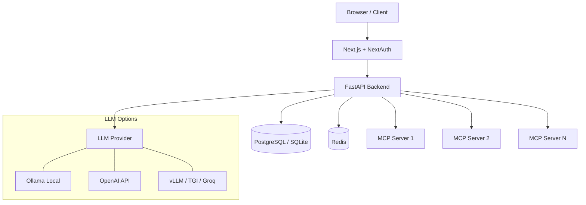

<div align="center">

# Mosaic

**A modular multi-agent AI assistant with streaming chat, extensible tool servers, and multi-provider LLM support.**

[](https://python.org)
[](https://nextjs.org)
[](https://fastapi.tiangolo.com)
[](/LICENSE)

</div>

---

## Overview

Mosaic routes user queries to specialized AI agents — general chat, web search, document Q&A, and any [MCP](https://modelcontextprotocol.io/) tool server you connect. Responses stream token-by-token in real time.

**Key capabilities:**

- 🔀 Intelligent agent routing (general, web, RAG, custom tools)
- ⚡ Token-level streaming via SSE
- 🔐 Full authentication (OAuth + credentials, per-user isolation)
- 🧩 Hot-pluggable MCP tool servers (add/remove without restart)
- 🗄️ Persistent conversations (SQLite or PostgreSQL)
- 🐳 Docker-ready with Redis and PostgreSQL

---

## Quick Start

```bash
git clone https://github.com/Garvit-Mehra/Mosaic.git && cd Mosaic
./setup.sh      # checks deps, installs everything, validates .env
./start.sh      # starts backend + frontend + ollama
```

Then open **http://localhost:3000**

> Stop everything: `./start.sh stop`

<details>
<summary><strong>Manual setup</strong></summary>

```bash
# Backend
cd Backend && python -m venv ../.venv && source ../.venv/bin/activate
pip install -r ../requirements.txt
cp .env.example .env   # fill in keys

# Frontend
cd ../Frontend && npm install
cp .env.example .env   # set AUTH_SECRET

# Run
ollama serve                                            # Terminal 1
cd Backend && uvicorn cifastapi_mosaic:app --port 8080  # Terminal 2
cd Frontend && npm run dev                              # Terminal 3
```

</details>

---

## Architecture


```mermaid
graph TB
    Client[Browser / Client]
    Frontend[Next.js + NextAuth]
    Backend[FastAPI Backend]
    LLM[LLM Provider]
    DB[(PostgreSQL / SQLite)]
    Redis[(Redis)]
    MCP1[MCP Server 1]
    MCP2[MCP Server 2]
    MCPN[MCP Server N]

    Client --> Frontend
    Frontend --> Backend
    Backend --> LLM
    Backend --> DB
    Backend --> Redis
    Backend --> MCP1
    Backend --> MCP2
    Backend --> MCPN

    subgraph "LLM Options"
        LLM
        Ollama[Ollama Local]
        OpenAI[OpenAI API]
        Compat[vLLM / TGI / Groq]
    end

    LLM --- Ollama
    LLM --- OpenAI
    LLM --- Compat
```

---

## Tech Stack

| Layer | Technology |
|-------|-----------|
| Frontend | Next.js 15 · React 19 · Tailwind CSS · NextAuth v5 |
| Backend | FastAPI · LangChain · LangGraph · SQLAlchemy |
| LLM | Ollama · OpenAI · Any OpenAI-compatible API |
| Database | SQLite (dev) · PostgreSQL (prod) |
| Cache | Redis |
| Auth | JWT · bcrypt · OAuth (Google, GitHub, Microsoft) |
| Infra | Docker Compose |

---

## Documentation

| Document | Description |
|----------|-------------|
| [Backend/API.md](Backend/API.md) | REST API reference |
| [Backend/DEPLOYMENT.md](Backend/DEPLOYMENT.md) | Deployment, scaling, LLM providers |
| [Frontend/AUTH.md](Frontend/AUTH.md) | Authentication setup & OAuth |
| [CHANGELOG.md](CHANGELOG.md) | Version history |

---

## Docker

```bash
docker compose up --build
```

Starts PostgreSQL, Redis, Backend (8080), and Frontend (3000) with health checks and dependency ordering.

---

## License

[Non-Commercial, No-Distribution License](LICENSE) © 2025 Mosaic Team
